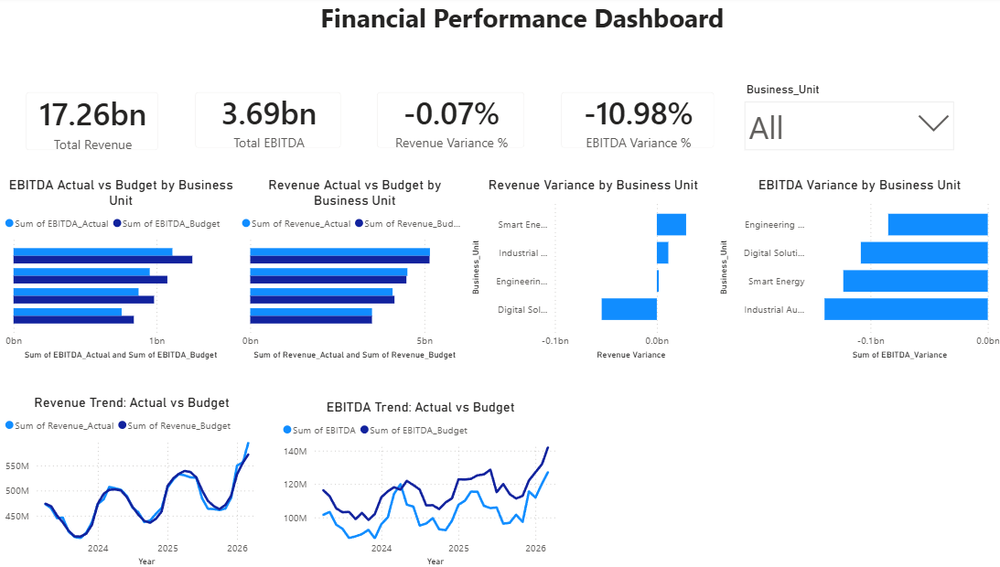

# Financial Performance Dashboard

An interactive Power BI dashboard designed to analyze financial performance across business units, comparing actual results against budget and identifying revenue and EBITDA variances.

## Project Overview

This project analyzes financial performance using revenue, EBITDA, budget, and variance metrics across multiple business units.

The dashboard provides an executive-level view of:

- Revenue performance
- EBITDA performance
- Actual vs Budget comparison
- Revenue variance
- EBITDA variance
- Business-unit performance
- Monthly revenue and EBITDA trends

## Tools & Technologies

- Power BI
- DAX
- Data Modeling
- Data Visualization
- Financial KPI Analysis

## Key KPIs

| KPI | Description |
|---|---|
| Total Revenue | Overall actual revenue |
| Total EBITDA | Overall actual EBITDA |
| Revenue Variance % | Difference between actual and budgeted revenue |
| EBITDA Variance % | Difference between actual and budgeted EBITDA |

## Dashboard Analysis

### Business Unit Performance

Compares actual vs budgeted Revenue and EBITDA across business units.

### Variance Analysis

Identifies business units with positive and negative Revenue and EBITDA variance.

### Trend Analysis

Tracks monthly Revenue and EBITDA performance against budget over time.

### Interactive Filtering

The dashboard includes a Business Unit slicer allowing users to analyze performance for individual business units.

## Key Insights

The dashboard helps identify:

- Business units exceeding or falling below budget
- Revenue and EBITDA performance gaps
- Monthly financial performance trends
- Areas with significant negative variance
- Differences between actual and planned financial performance

## Repository Contents

- `Financial_Performance_Dashboard.pbix` — Power BI dashboard file
- `dashboard-preview.png` — Dashboard preview
- `README.md` — Project documentation

## Business Value

This dashboard can support management and finance teams in monitoring financial performance, identifying budget gaps, and understanding business-unit-level performance trends.

## Author

**Tanvi Kamat**

Data Analytics | SQL | Python | Power BI | Excel
